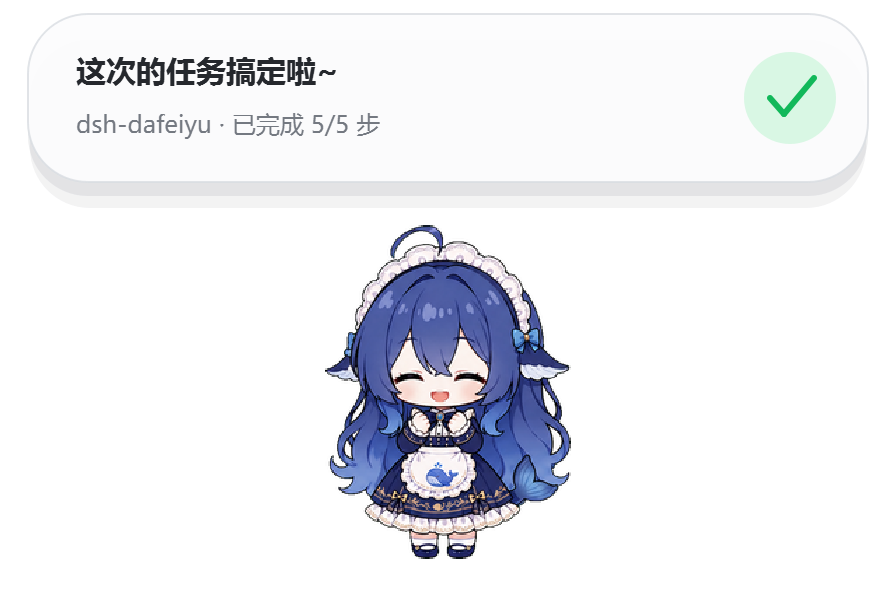
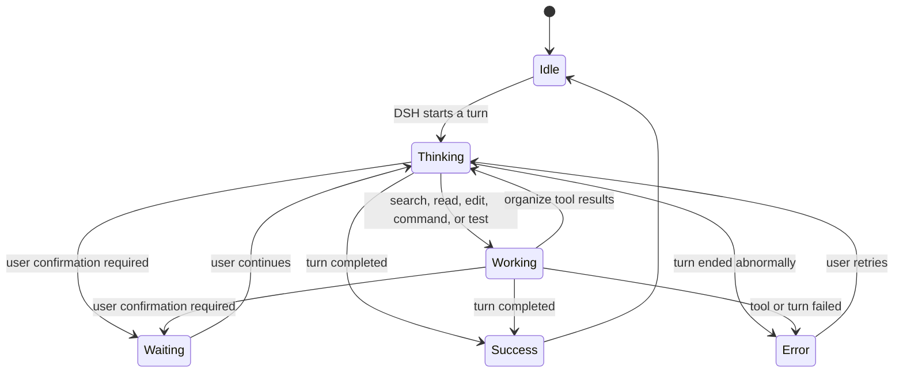

> [!IMPORTANT]
> **This is a brightness fork of [QCYTSN/dsh-dafeiyu](https://github.com/QCYTSN/dsh-dafeiyu), not the upstream repository.**
>
> - Base: upstream `0.1.14` (code MIT, visual assets MIT — see [ASSET_LICENSE.md](ASSET_LICENSE.md)).
> - **The only change here**: all **2600 frames** under `assets/pet/` (plus the identical set embedded in the
>   macOS helper) are raised to **1.25x brightness** (Pillow `ImageEnhance.Brightness`, per-frame RGB
>   multiply, alpha untouched). **No runtime logic was modified.**
> - Choose your own level: `python tools/brighten-assets.py restore` then `apply <factor>` (default 1.25).
> - ⚠️ **Do not install alongside upstream `dsh-dafeiyu`** — both register the same HTTP routes
>   (`/plugins/dsh-dafeiyu/*`) and the same settings key. This fork replaces it.
> - ⚠️ **macOS**: replacing files inside the `.app` invalidates upstream's ad-hoc signature; re-sign it
>   (`codesign -s - --deep`) or clear the quarantine attribute yourself.

## Install this fork

```powershell
dsh plugin --profile web remove dsh-dafeiyu
dsh plugin --profile web add https://github.com/zhlipe/dsh-dafeiyu-bright
```

<div align="center">

# DSH BigFish 🐋

**A desktop companion that reacts to real DeepSeek Harness activity.**

Enabled by DSH, owned by the DSH lifecycle, rendered on the desktop.

[中文](README.md) · [npm](https://www.npmjs.com/package/dsh-dafeiyu) · [Latest release](https://github.com/QCYTSN/dsh-dafeiyu/releases) · [Changelog](CHANGELOG.md) · [Update and rollback](docs/UPDATING.md) · [Acceptance notes](docs/ACCEPTANCE.md)

[](https://www.npmjs.com/package/dsh-dafeiyu) · [](https://github.com/QCYTSN/dsh-dafeiyu/releases)

</div>


DSH BigFish is not a standalone desktop-pet application. DSH enables the plugin, starts and
stops its native Helper, and provides the Agent events that drive it. The transparent,
frameless companion stays above other desktop apps, so you can see whether DSH is thinking,
editing, testing, waiting, or finished while working in VS Code, a browser, or File Explorer.

> Current version: `0.1.14` · Windows / WSL2 / Linux x64 · experimental macOS support

## Follow updates

- The latest version always matches npm [`latest`](https://www.npmjs.com/package/dsh-dafeiyu) and [GitHub Releases](https://github.com/QCYTSN/dsh-dafeiyu/releases) (which also carry the `.tgz` archives); the badges above update automatically.
- **Starring is just a bookmark — GitHub will not notify you of updates.** To get notified about what changed:
    1. Open the repo and choose **Watch → Custom → Releases**;
    2. or subscribe to the Releases feed: <https://github.com/QCYTSN/dsh-dafeiyu/releases.atom>
- To upgrade an installed copy: fully exit DSH, then run
  ```powershell
  dsh plugin --profile web update dsh-dafeiyu
  ```
  and start DSH again.

## What is it for?

- **See DSH status away from the WebUI:** BigFish stays on top of the desktop.
- **React to real Agent events:** it does not inspect the screen or mistake activity in other apps for DSH work.
- **Show the effective reasoning effort:** when DSH reports the effort actually applied to a request, the status detail keeps it visible instead of guessing from the model name.
- **Show useful, compact context:** the card can display the project, current phase, active step, and real todo progress.
- **Feel alive without becoming noisy:** thinking, searching, editing, commands, testing, waiting, success, and errors have distinct motion and friendly copy.
- **Avoid a second app experience:** users do not launch the Helper, install Python, or configure another port.

If DSH has not emitted a structured todo list, BigFish shows reliable phases such as
“Analysis,” “Implementation,” or “Verification” instead of inventing a percentage.

## Status previews

| Thinking | Working |
| --- | --- |
|  |  |

| Waiting for you | Complete |
| --- | --- |
|  |  |

| Needs attention |
| --- |
|  |

The high-level state flow is:



When several DSH sessions run at once, the default attention priority is:

`Waiting > Error > Working > Thinking > Idle`

When multiple tasks are active, the status bubble lists them at the same time.

## Requirements

- Windows 10/11 x64, or WSL2 (runs the desktop Helper through Windows interop)
- Linux x64 desktop (glibc ≥ 2.35; desktop verified only on Ubuntu 24.04 / glibc 2.39)
- macOS 12.0+ (Apple Silicon or Intel, experimental support)
- A working DeepSeek Harness WebUI installation
- A DSH CLI that supports `plugin --profile web`
- the stable `dsh-dafeiyu` from npm (or `dsh-dafeiyu@alpha` to try prereleases early), or a `.tgz` archive from GitHub Releases

Regular users do **not** need Python or PySide6 and should not launch the Helper
manually. Windows, Linux x64, and macOS Helpers are bundled in the release archive.

The current Alpha build uses Simplified Chinese for the settings UI and desktop status copy.

## Install

### 1. Fully exit DSH

Stop the DSH Host, not only the browser tab. An old Helper should not remain active during
installation or upgrade.

### 2. Install

### Windows users

Open PowerShell in your DSH installation directory, for example:

```powershell
cd D:\DSH
```

Install the current stable release from npm:

```powershell
pnpm dsh plugin --profile web add dsh-dafeiyu
```

If `dsh` is already available globally, the command is simply:

```powershell
dsh plugin --profile web add dsh-dafeiyu
```

To try new features before they are stable, install from the `@alpha` tag instead:
`pnpm dsh plugin --profile web add dsh-dafeiyu@alpha`.

When DSH runs inside WSL2, run the same install command in the WSL terminal. In
visual mode the plugin launches the bundled **Windows** Helper through
`cmd.exe`; no manual `chmod`, Python, or PySide6 installation is required
inside WSL. Native Linux desktops use the bundled Linux Helper instead of the
Windows `.exe` — see the next section.

### Linux users (x64 desktop, glibc ≥ 2.35)

Installation on Linux is the same as Windows, just in a terminal with Linux
paths. The release bundle ships a prebuilt Helper — **no Python or PySide6
required**.

Requirements:

- An x86_64 desktop distro with **glibc ≥ 2.35** (the official binary is built
  on Ubuntu 22.04).
- **Desktop use has been verified only on Ubuntu 24.04 (glibc 2.39).** Ubuntu
  22.04 and other distros have not had a real desktop acceptance pass; CI only
  builds and smoke-tests on Ubuntu 22.04 under Xvfb.
- A graphical session (`DISPLAY` or `WAYLAND_DISPLAY`). The Helper prefers
  X11 / XWayland (`xcb`), then Wayland.
- Debian / Ubuntu desktops usually also need `libxcb-cursor0`.
- ARM, headless SSH, containers, and server-only environments are not desktop
  display targets for this version.

In a terminal, `cd` into your DSH installation directory (for example
`~/deepseek-harness`):

```bash
cd ~/deepseek-harness
```

Install the current stable release from npm:

```bash
pnpm dsh plugin --profile web add dsh-dafeiyu
```

Alternatively, download `dsh-dafeiyu-<version>.tgz` from
[GitHub Releases](https://github.com/QCYTSN/dsh-dafeiyu/releases) (do not
extract it) and install it:

```bash
pnpm dsh plugin --profile web add ~/Downloads/dsh-dafeiyu-<version>.tgz
```

Then launch DSH WebUI normally; BigFish is started automatically. Do not start
the Helper yourself.

### macOS users (Apple Silicon / Intel, macOS 12.0+)

> Version `0.1.4` introduces the native macOS Helper as experimental support.
> CI verifies its universal architecture, AppKit rendering, and process lifecycle;
> Apple Silicon experience will continue to be validated through user feedback.
> The app currently has an ad-hoc signature, not a Developer ID signature or
> notarization. Gatekeeper only triggers in specific scenarios; see
> "About macOS Gatekeeper" below.

Installation on macOS is the same as Windows, just in the Terminal with macOS
paths. The release bundle ships a native Helper — **no Python, PySide6 or Xcode
required**.

In Terminal, `cd` into your DSH installation directory (for example
`~/deepseek-harness`):

```bash
cd ~/deepseek-harness
```

Install the current stable release from npm:

```bash
pnpm dsh plugin --profile web add dsh-dafeiyu
```

If `dsh` is already available globally:

```bash
dsh plugin --profile web add dsh-dafeiyu
```

Alternatively, download `dsh-dafeiyu-<version>.tgz` from
[GitHub Releases](https://github.com/QCYTSN/dsh-dafeiyu/releases) (do not
extract it) and install it:

```bash
pnpm dsh plugin --profile web add ~/Downloads/dsh-dafeiyu-<version>.tgz
```

Then launch DSH WebUI normally; BigFish is started automatically. Do not start
the Helper yourself.

#### About macOS Gatekeeper

Verified conclusions (see issue
[#24](https://github.com/QCYTSN/dsh-dafeiyu/issues/24)): installing from npm,
downloading via the terminal, and installing a browser-downloaded `.tgz`
**directly** all bypass Gatekeeper. Only an `.app` extracted with Finder
carries the quarantine attribute and gets blocked on double-click.

- Recommended: after downloading the `.tgz` in a browser, **do not extract it
  with Finder** — run the install command above directly (npm/tar extraction
  does not propagate quarantine attributes).
- Downloading in a terminal never creates quarantine attributes in the first
  place:

  ```bash
  gh release download --repo QCYTSN/dsh-dafeiyu
  # or
  curl -LO https://github.com/QCYTSN/dsh-dafeiyu/releases/download/v<version>/dsh-dafeiyu-<version>.tgz
  ```

- If you already extracted with Finder and got blocked: right-click the Helper
  → "Open" once to allow it, or clear the quarantine attribute and run it:

  ```bash
  xattr -dr com.apple.quarantine <path to the extracted dsh-dafeiyu-helper.app>
  ```

### 3. GitHub Release fallback

Open [GitHub Releases](https://github.com/QCYTSN/dsh-dafeiyu/releases) and download:

```text
dsh-dafeiyu-<version>.tgz
```

Do not extract it. Install the downloaded archive from the DSH directory:

```powershell
pnpm dsh plugin --profile web add "C:\Users\you\Downloads\dsh-dafeiyu-<version>.tgz"
```

### 4. Start DSH

Launch the DSH WebUI normally. The plugin is enabled by default, and DSH starts BigFish
automatically. Do not start the Helper yourself.

### 5. Open the settings

In the DSH WebUI, go to:

```text
Settings → Plugins → Plugin configuration → BigFish Desktop Companion
```


## How to use it

There is no separate workflow after installation:

1. Start DSH.
2. Begin a project task in DSH.
3. BigFish reacts to real DSH events and updates its animation and status card.
4. Switch to another app; BigFish remains above the desktop.
5. BigFish exits automatically when the DSH Host actually stops.

The status card can show:

- the project directory, such as `dsh-dafeiyu`
- the current phase, such as Analysis, Implementation, or Verification
- the active todo, such as “Improve project documentation”
- real progress, such as “3/5 steps complete”
- waiting, success, or error messages

BigFish does not watch VS Code, browsers, or other apps and does not take screenshots. Only
DSH Agent events can change its work state.

## Settings

| Setting | Purpose |
| --- | --- |
| Enable BigFish | Show or stop the desktop companion immediately |
| Character size | Scale the character from 55% to 140%; the context menu includes a 60% mini preset |
| Bubble size | Scale the status bubble from 80% to 120% while keeping status text readable |
| Bubble visibility | Always show, hide completely, or choose which states show the bubble |
| Activity level | Control the frequency of idle blinks and micro-animations |
| Reduced motion | Reduce walking, looping frames, and procedural movement |
| Notification sound | Play or mute BigFish's original sound when a task succeeds or fails |
| Include subagents | Allow subagent sessions to participate in status priority; off by default |

DSH persists these settings, so a normal plugin update does not require reconfiguration.

## Desktop interactions

- **Drag:** move BigFish; its position is saved automatically. Releasing it plays brief release, dizzy, and protest reactions, skipped automatically when reduced motion is enabled.
- **Click or double-click:** trigger brief head-pat, poke, or tail reactions, then return to the latest DSH state.
- **Right-click:** change size, bubble size, reduce motion, open WebUI, hide for now, or close for this run.
- **Hide for now:** hides the window without disabling the plugin.
- **Close for this run:** closes the current Helper and suppresses restart until the next DSH launch.

## Update

An installed plugin does **not** change when new commits appear on GitHub. After a new version
is published, fully exit DSH and update the npm stable package:

```powershell
cd D:\DSH
pnpm dsh plugin --profile web update dsh-dafeiyu
```

Running the install command again also resolves the newest version behind the npm `latest` tag:

```powershell
pnpm dsh plugin --profile web add dsh-dafeiyu
```

Users who opted into `@alpha` can run the same commands with the package name `dsh-dafeiyu@alpha` instead.

Users who installed from GitHub Releases can download the new `.tgz` and install it over the
old version:

```powershell
pnpm dsh plugin --profile web add "C:\Users\you\Downloads\dsh-dafeiyu-<new-version>.tgz"
```

All three paths replace the plugin and bundled Helper while retaining settings saved
by DSH. See [Update and rollback](docs/UPDATING.md) for details.

## Roll back

Fully exit DSH and install a previously saved release archive with the same `add` command:

```powershell
cd D:\DSH
pnpm dsh plugin --profile web add "C:\Users\you\Downloads\dsh-dafeiyu-<old-version>.tgz"
```

## Uninstall

Fully exit DSH, then run:

```powershell
cd D:\DSH
pnpm dsh plugin --profile web remove dsh-dafeiyu
```

Restart DSH afterward. The plugin and Helper are removed from the `web` profile. DSH may keep
an inactive copy of historical settings; it does not start a process or open a port.

## Troubleshooting

<details>
<summary><strong>BigFish does not appear after installation</strong></summary>

1. Confirm that you installed into `--profile web`.
2. Fully stop and restart the DSH Host.
3. Open “Settings → Plugins → Plugin configuration” and confirm that BigFish is enabled.
4. Use a release archive that contains the prebuilt Helper for your platform, not a
   source-only clone. Windows / WSL2 needs `runtime/bin/win32-x64`; native Linux
   desktops need `runtime/bin/linux-x64`; macOS needs `runtime/bin/darwin`.

</details>

<details>
<summary><strong>Why does BigFish remain after I close the DSH browser tab?</strong></summary>

BigFish follows the DSH Host lifecycle, not the browser tab. It remains visible while the DSH
backend is still alive and exits when the Host actually stops.

</details>

<details>
<summary><strong>Why is there no numeric progress?</strong></summary>

The plugin can calculate “3/5 steps complete” only when DSH emits a structured todo list.
Without real progress data, the card shows the current phase instead of inventing a percentage.

</details>

<details>
<summary><strong>Why does BigFish not restart after “Close for this run”?</strong></summary>

That command intentionally suppresses automatic restart for the current DSH run. Fully restart
DSH to bring it back. To disable it permanently, turn off “Enable BigFish” in DSH settings.

</details>

## Privacy and boundaries

- Does not read or store model API keys
- Does not take screenshots or inspect other windows
- Does not send telemetry
- Does not monitor keyboard input or other app activity
- Does not open a new network port; the settings card reuses DSH's local Web service
- Follows the most recently active top-level DSH session by default

## Native macOS port (AI-assisted)

> **Note**: the native macOS helper (`runtime/bin/darwin/dsh-dafeiyu-helper.app`)
> and the Swift sources under `native/macos/` were **generated with AI
> assistance**, reviewed and debugged by a human before being merged. They
> replace the original Qt/PySide6 and PyObjC prototypes, which were unstable
> and crash-prone on macOS.

What was redone:

- **Runtime rewrite**: the Qt/PySide6 window (the visual path of
  `runtime/helper.py`) and the PyObjC native-window prototype were rewritten as
  a **pure Swift + AppKit** implementation. Python, PySide6, PyObjC and
  conda environments are no longer required.
- **Animation engine port**: the pure logic of `runtime/animation_model.py`
  (clips, pulse, overlay, idle micro-motions, crossfade, procedural motion)
  was ported line-by-line to Swift with behavior parity with the Windows/Qt
  version.
- **Above-fullscreen window**: Apple's official window capabilities
  (`canJoinAllSpaces` + `fullScreenAuxiliary` + `.floating` level), re-asserted
  every 2 seconds so the pet stays in front of full-screen apps.
- **Permissions**: notifications via `UNUserNotificationCenter` (SUCCESS/ERROR
  alerts, falling back to beep + shake when denied); Accessibility via
  `AXIsProcessTrustedWithOptions` with a System Settings deep link in the
  context menu.
- **Stability fixes**: EPIPE guards on the helper's stdin/stdout/stderr so a
  helper crash only restarts the helper itself, never the dsh server.
- **Rendering/interaction fixes**: fixed the upside-down image in the flipped
  view, made dragging track the cursor 1:1 with absolute coordinates, and kept
  the character and the status bubble in sync while dragging.
- **Layout migration**: on first launch the old Qt top-left coordinates are
  migrated to AppKit bottom-left, still reading/writing the same `layout.json`.

Compatibility:

- **Architecture**: Universal binary (Apple Silicon arm64 + Intel x86_64)
- **System**: macOS 12.0+
- Build and install instructions: [native/macos/README.md](native/macos/README.md)

## Development and tests

```powershell
pnpm install
npm test
py -3 -m unittest discover -s runtime/tests -t .
```

Developers can run the source Helper directly, but regular users should not:

```powershell
py -3 -m pip install -r requirements.txt
py -3 runtime\helper.py
```

Build the Windows Helper:

```powershell
python -m pip install -r requirements.txt pyinstaller
$env:DSH_DAFEIYU_BUILD_PYTHON = (Get-Command python).Source
npm run build:helper:windows
```

Build the Linux Helper (Linux x86_64 required; official releases are built on
Ubuntu 22.04 to keep the glibc 2.35 baseline):

```bash
python3 -m pip install -r requirements.txt pyinstaller
export DSH_DAFEIYU_BUILD_PYTHON="$(command -v python3)"
npm run build:helper:linux
```

macOS native Helper build instructions: [native/macos/README.md](native/macos/README.md).

## More documentation

- [Product scope and trade-offs](docs/PRODUCT_SCOPE.md)
- [Windows acceptance and performance](docs/ACCEPTANCE.md)
- [Update, rollback, and uninstall](docs/UPDATING.md)
- [Maintainer release workflow](docs/RELEASING.md)
- [Character asset license](ASSET_LICENSE.md)

Related project: [QCYTSN/ds-local-pet](https://github.com/QCYTSN/ds-local-pet) is the
standalone desktop-pet version. This repository is the DSH-only companion plugin.

## License

Code is released under the [MIT License](LICENSE).

The current character animation set (`assets/pet/`) is imported from the
community project [dsh-pet](https://github.com/PC2005-cloud/dsh-pet)
(Copyright © 2026 PC2005-cloud, MIT license): we selected and re-encoded 16
clips under its MIT terms, and the upstream license ships in the package as
`assets/dsh-pet-LICENSE.txt`. Many thanks to the dsh-pet authors for the
high-quality assets and the published AI-generation recipes.

The earlier BigFish frames are archived under `legacy/dafeiyu/` (no
longer bundled) and keep their original restricted terms. Full provenance and
usage boundaries are documented in [ASSET_LICENSE.md](ASSET_LICENSE.md).
